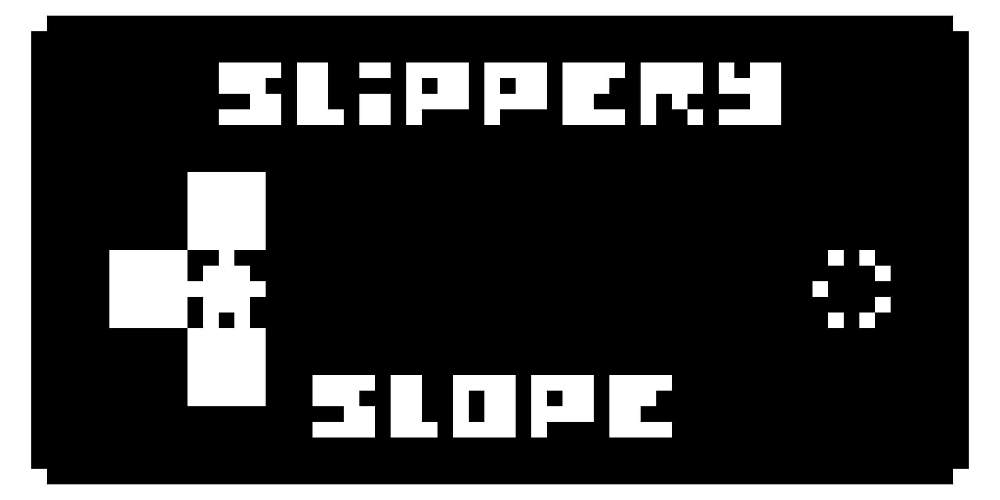
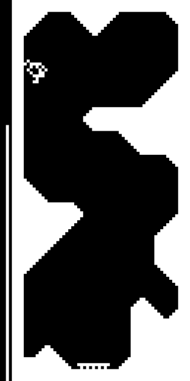
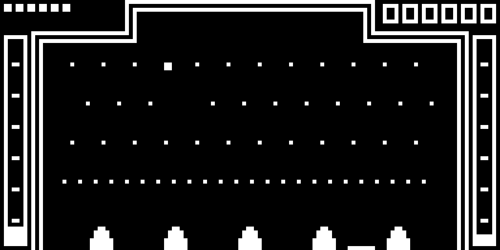

# darkerbit's CHIP-8 emulator

This is an emulator for [the CHIP-8 virtual machine](https://en.wikipedia.org/wiki/CHIP-8),
an interpreted programming language that people have been making games with since the 1970s.

It doesn't have sound, but it does emulate the  rest of the CHIP-8, SCHIP and XO-CHIP instruction sets.

## How use?

`./dbchip [-vertical] [-speed <cycles per second>] <rom file>`

The compiled executable is included in the repository in case you don't want to build it.

Requires SDL2 to be installed, though you most likely already have it.
If you don't, you can probably `apt` or `dnf` it fairly easily.

## How build anyway?

```shell
mkdir build
cd build
cmake ..
make
```

## Platform support?

Only tested on Linux, though it may build on some other UNIX-likes as well. It won't build on Windows because I use
Linux-specific timer functionality because SDL2's timers simply weren't precise enough.
There is an abstraction layer so I could add a Windows timer system at some point in the future.

## Screenshots?







